import Tabs from '@theme/TabItem';
import TabsItem from '@theme/TabItem';

In the past few weeks, Sally has successfully demonstrated the scaling capabilies and helps to 
prevent a malicious virus from propagating the company network. In the coming weeks, she has been 
tasked to monitor the situation and understand their how their application foot print has been 
growing so that they can plan for their growth. With the financial cycle refreshing Sally has 
limited time to make a decision.In order to do that, Sally needs to understand how their 
applications are functioning in a much greater depth.

## Monitoring Configurations

Application monitoring provides visibility into integrated applications by collecting application 
metrics using Nutanix and third-party collectors, providing a single pane of glass for both 
application and infrastructure data, correlating application instances with virtual infrastructure, 
and providing deep insights into applications performance metrics.

Application monitoring provides visibility into:

1. VMWare vCenter Servers.

2. Microsoft SQL Server.

In this short lab, we will turn on Microsoft SQL Server monitoring and subsequently **Application Discovery**
to enable us to discover application co-relation in their environment.

:::note
There are already four Microsoft SQL Server instances that has been pre-configured for this exercise.
Please note the IP address of the SQL server instance you are assigned.
:::

## Microsoft SQL Server Monitoring

1. In **Prism Central ** console, go to **Operations**> **Monitoring Confgurations**.
   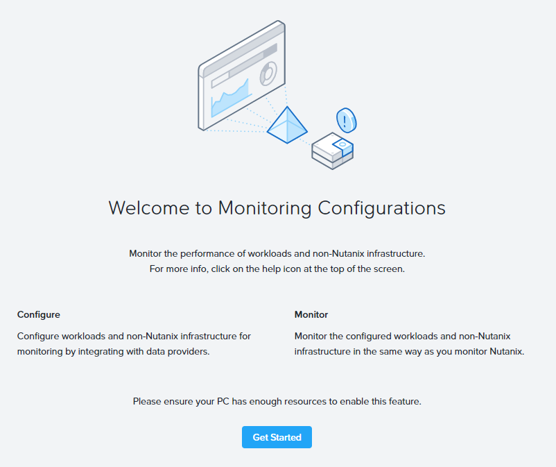

   If you see this splash screen, click **Get Started** to begin.

2. Click **Configure New Instance** to start adding an application instance.

3. Please fill out the following fields:
      - **External Entity Type:** Microsoft SQL Server
      - **Microsoft SQL Server Host:** _your assigned IP address_
      - **Username:** SQLSERVER\administrator
      - **Password:** Nutanix/4u

4. Click *Test Connection**.

5. Click **Save**.

6. Click on the instance name.
   
   The instance name and the following set of tabs appear on the left: **Summary**, **Alerts**, 
   **Events**, **Databases**, **Queries**, and **Metrics**. Click a tab to display that information 
   on the right. (Click the Back to External Entity Instances link to return to the summary view.)
   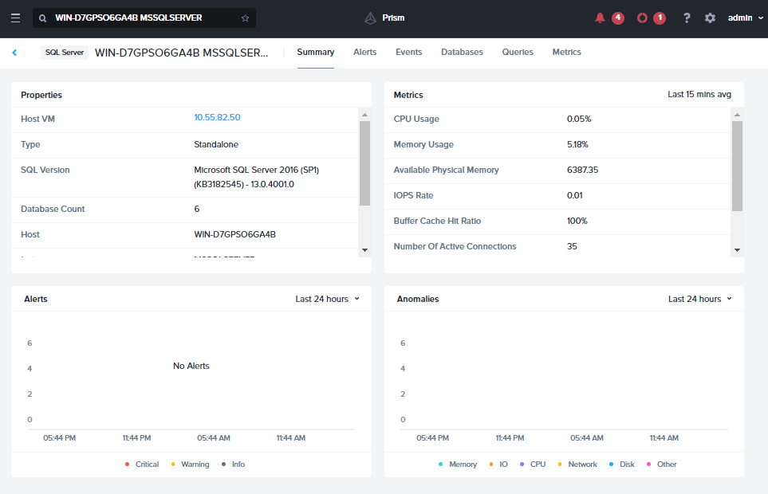

7. Click on the **Databases** tab.
   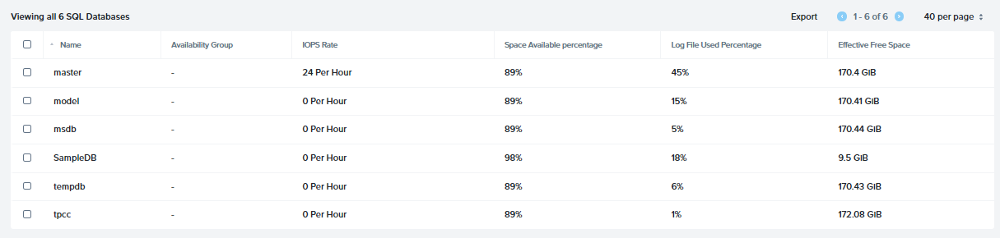 
   
   Notice that without logging into the SQL server, you are able to have a view of the entire databases 
   located in that instance. General information regarding the databases such as: **Availablilty Group**,
   ** IOPS Rate**, **Space Availability percentage**, **Log File Used Percentage** and **Effective
   Free Space** are all critical information to have right at your fingertips!

   Click on the database, this will shows each individual database metrics.

   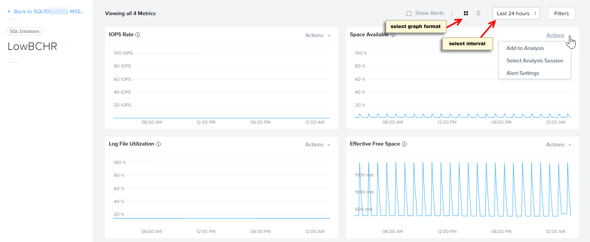

8. Next, click on **Queries**.
   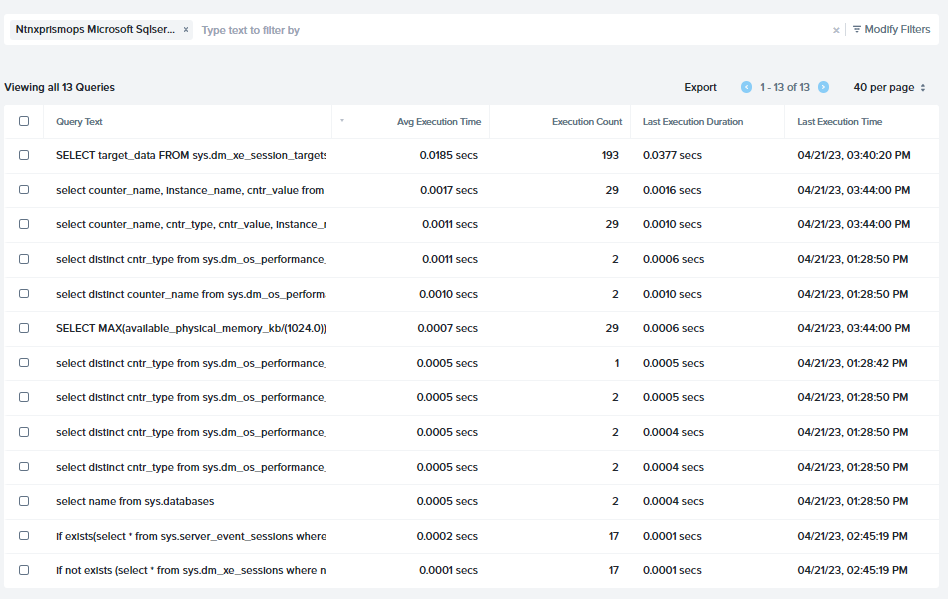

   This shows a list of queries that has been made to the databases. Notice that you can benchmark
   the queries against its performances, with the vital information such as **Avg Execution 
   Time**, **Execution Count** and the **Last Execution Time and Duration**

9. Lastly, click on **Metrics**, this is where you will get all 16 related metrics.
   These custom metrics are all related to a database use case where with a single glance, you 
   can spot issues related to performance or stability.

## App Discovery

Another aspect of understanding the co-relation between the apps provisoned in the environment is
**App Discovery**. Application discovery provides the capability to discover applications in a 
specified set of clusters, identify in which VM each application runs and what ports it uses, and 
publish that data to an internal database which is accessible through an external API call. You can
monitor applications in Nutanix, non-Nutanix (vCenter managed), or mixed (cluster with mixed 
hypervisors) environment.

:::note 
Due to App Discovery being a cluster-wide feature. The setup is done only once. If you are one of the
first to reach this stage of the please continue to follow the steps below.
Otherwise, please read through the rest of this section.
:::

1. To enable APP Disocvery, you first need to get an API key from my.nutanix.com:
   https://my.nutanix.com/page/apikeys?action=create&source=Prism%20Ops
   a. Click Create API Key
   b. **Create API Key:** _cluster name_-APIKey 
   c. **Scope:** Prism Ops
   d. Click **Create**.
   e. The cluster API key will be generated
      - copy the API key and key ID to a safe place
      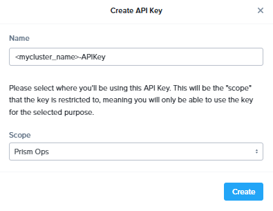

2. In **Prism Central**, go to **Operations**> **Discovery**.
   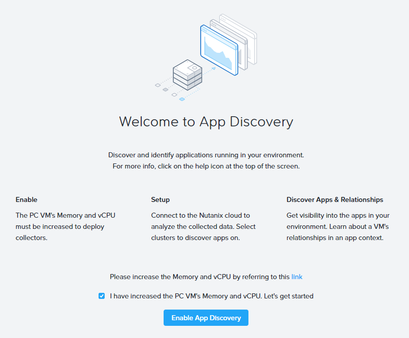

2. Do the following:
   - **I have increased the PC VM's Memory and vCPU. Let's get started:** tick the check box
   - Click **Enable App Discovery**

3. Enter your API key and Key ID when prompted

4. Select your cluster(s) from the list and click **Discover Apps**.
   
5. Click **OK, got it!**

You will see some other apps running, this is part of the data that gets pre-seeded along with the 
inefficient VMs.

  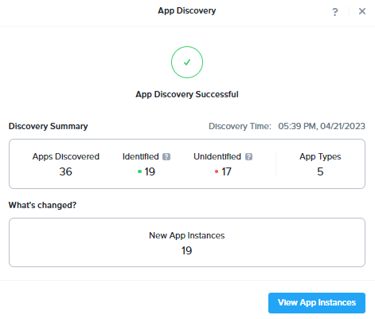

6. Click **View App Instances**. 

7. This will bring you to a list of all the apps running in the cluster.

  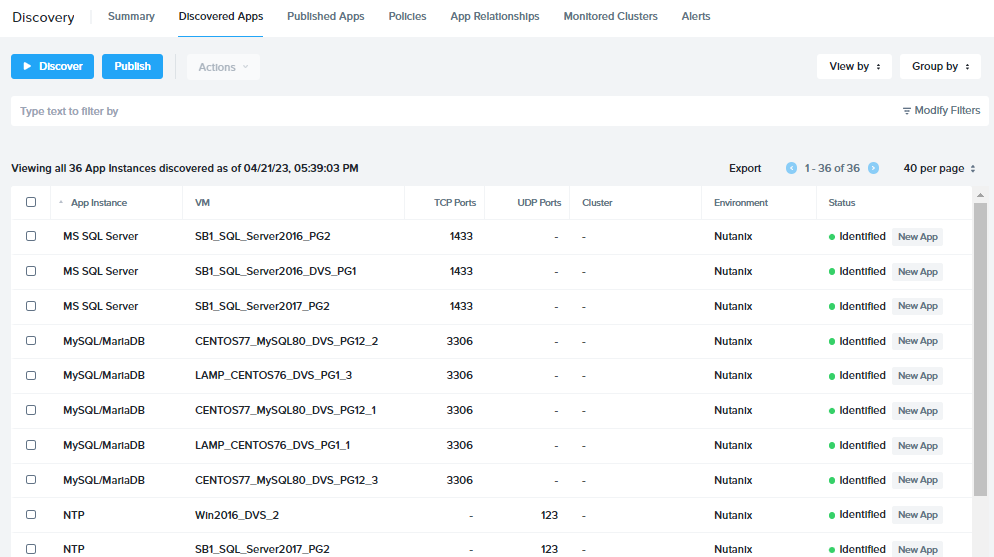

8. The dashboard includes seven tabs at the top 
   - **Summary** 
   - **Discovered Apps**
   - **Published Apps** 
   - **Policies** 
   - **App Relationships** 
   - **Monitored Clusters**
   - **Alerts** 
   with a display area below for the selected tab.

9. Click on **App Relationship**.
   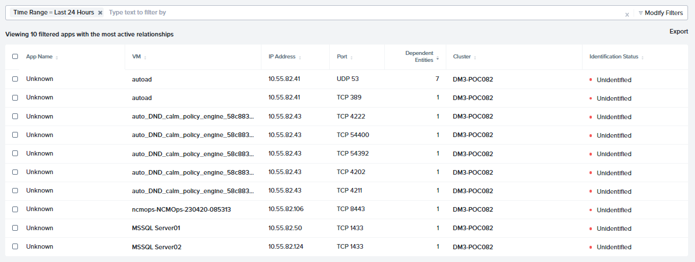

10. This auto filter list as seen above contains all newly discovered apps in the last 24 hours!
    They are also automatically filter according to the most active. (notice the top app having 7 
    relationships)

11. Click on the first VM known as **autoad**.
    
12. On the top banner menu, click on **App Relationship** to bring on a visual view on the 
    application.
    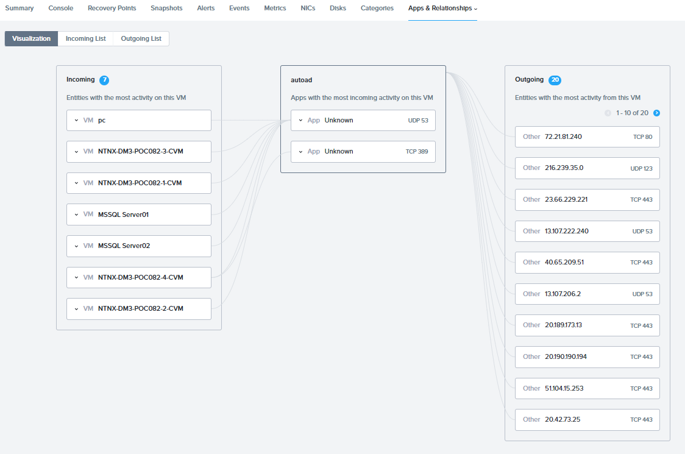

13. Do note of the **ports** the communication is being established between the apps.

 Congratulations!!

 ## Key Takeaways

 With those insights that are provided, one can easily formulate the relationshsip between the applications whether if 
 they are deployed within a Nutanix cluster or an external VMWare environment. Those vital information can assist any 
 IT Org to troubleshoot their existing operational issues, and to also project any future expenditure with **Capacity Planning**
 (not covered in this lab) You can view them under **Prism Central Menu** > **Operations** > **Planning**

 The apps relation can also assist any IT Org with their security planning by securing East-West bound traffic with 
 micro-segmentation.
 

 
     
    

 
   

  

   

   

