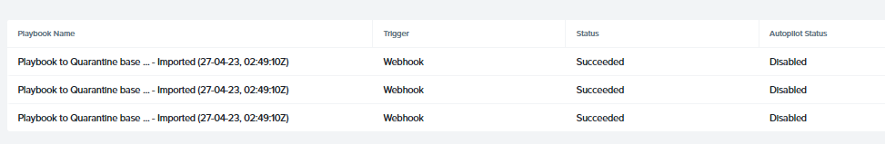

import Tabs from '@theme/TabItem';
import TabsItem from '@theme/TabItem';

Sally has once again resolve operational issues within her environment by deploying the 3-tier 
application with auto scaling of the web servers with Calm automation. Sally has seen the number 
of support issues coming down and the business is able to achieve 100% of their target!!
However, in one of the cases she has came across, a late response in the SecOPs team in quaranting 
an infected VM almost brought down the entire infrastruture down. In order not to repeat the same 
situation again, she is once again being tasked to look into this matter.

## Automate Quarantine Process with X-Play

You are to implement the process of automating quarantine of an infected VM. In this lab, we will implement
this feature utilizing **Nutanix Flow Microsegmentation**, **Solarwinds** and a **Windows IIS Server** 

There are already **1 x Solarwinds** server, together with **4 x Windows IIS servers** pre-configured
for this lab, you are to select only one target VM according to your assigned user name, e.g adminuser01-
target-VM-1, etc
- **Solarwinds**
- **Target-VM-1**
- **Target-VM-2**
- **Target-VM-3**
- **Target-VM-4**

The target-VMs are name according to your numbering of you username e.g adminuser01 - Target-VM-1,
adminuser02 - Target-VM-2...
In addition, there are four playbooks which have been created and loaded prior to the lab. The
four playbooks are:

- **Playbook to Quarantine Base** - this playbook is created to allow Solarwinds to trigger a API call to 
  Prism Central when it detects abnormal behaviour.
- **Webhook Move to Quarantine** - this playbook serves as an action trigger to move the VM into Quarantine
- **Playbook to Remove Quarantine** - Triggers via Solarwinds when releasing the infected VM
- **Webhook Remove from Quarantine** - The action serves to remove the infected VM from Quarantine.

## How the Webhook is setup in Solarwinds

1. Identify the IP address of the **Solarwinds** server, and rdp or console into the server.
   - username: administrator
   - password: nutanix/4u

2. Once you are in the console, use either **Mozilla** or **Edge** browser and enter the IP address
   of the server with port 8787. e.g https://10.80.55.36:8787
   - username: admin
   - password: nutanix/4u

3. In Solarwinds web console. Go to the **Alerts Manager** at the middle of the top menu.
   Click **Alerts & Activity** > **Alerts**

   

4. On the top right side of the window, click **Manage Alerts**.
   
   

5. In **Alert Manager**, on the far right search box, type **IIS DOWN** and click on the magnifying glass icon to search
   for the policy.

   

6. Click on **IIS DOWN**.

7. Click on **Trigger Actions**. Then **Trigger Prism Central** > **EDIT** at the right side of the screen.

8. You will see a API call to trigger **Playbook to Quarantine** inside our Playbooks.

   

## Setting up Your Playbooks.

9. Open up **Playbook to Quarantine** and cross check the UUID
   of the playbook declared in **Solarwinds**. If they are not the same, please replace it with the UUID of the Playbook.

10. Back at Prism Cental, open up **Webhook Move to Quarantine** and note down the UUID. You will need this UUID.

11. Back at **Playbook to Quarantine**, open up the playbook, click **update**.

12. Go to the first **REST API** and update your cluster credentials in the **Username** and **Password** boxes.

12. Then, go to the last **REST API** action, and look at **Request Body**. Copy the UUID from **Webhook Move to Quarantine**
    to the "webhook_Id" and replace it with your own UUID of the webhook.

    

13. Back at Solarwinds web console. Click **NEXT**. You will proceed to **RESET ACTIONS**. 

14. Repeat steps **7-12** for **Playbook to Remove Quarantine** and ensure Solarwinds makes the right API call to the playbook.

15. On the Solarwinds web console, please click **NEXT** and then **SUBMIT** to ensure the changes are being capture.

## Testing the Playbooks

You are set to test the playbooks! Wait!! Before you proceed to the next steps, please ensure that
the playbooks are set to **Enabled** status.

## Auto Quarantine an Infected VM

To test the playbooks, you need to bring down IIS services in the **Target_VM0x** that has been pre-configured.

1. Go to your assigned **Target_VM**. e.g Target-VM-1, Target-VM-2, etc

2. RDP or open the console of the machine.

3. Go to Windows **Start** > Windows Administration Tools** > **Internet Information Services (IIS) Manager**.

4. Next, go to Prism Central > **Network & Security** > **Security Policies** 

5. Back to the TargetVM machine console, click **Stop** to stop the IIS service. This will cause Solarwinds to trigger
   an alert.

   

6. Observe in Prism Central as the API calls are being triggered. You should see your target machine in the quarantine zone.

   
   
   In addition, you can go to the playbook - **Playbook to Quarantine Base**, click on the playbook, and **Plays**
   to see that the playbook has been executed successfully.

   

   Congrats! You have successfully qurantine the infect machine!

## Releasing a Quarantined VM 

1. To release the quarantine VM back to its original environment. Click on **Start** in the IIS Manager console.

   :::note
   In a Production environment, the quarantine machine ought to be total isloation. For the interest of this lab,
   the console connection still remains to faciliate the simulation.
   :::

2. This will release the machine back to environment, **Start** the IIS service again in the IIS Manager console.
   This will take around 5-7 minutes. 

3. Observe the following:
   - Solarwinds Alerts 
   - In Prism Central **Security Policies**, the Quarantined count should reset to zero or one less.
   - In **Playbook to Remove from Quarantine** > **Plays**. The latest status should show **succeeded**.

## Keytakeaways

Playbooks are an excellent way to automate day to day tasks which are often repetitive by nature.
In this example, although Solarwinds are being featured, it does not mean and restrict by the support 
on 3rd party SIEM solutions are by far the end. Any good known SIEM solution who supports similar API call
functions would be able to do the same.

   

   

   

