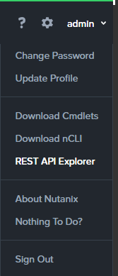
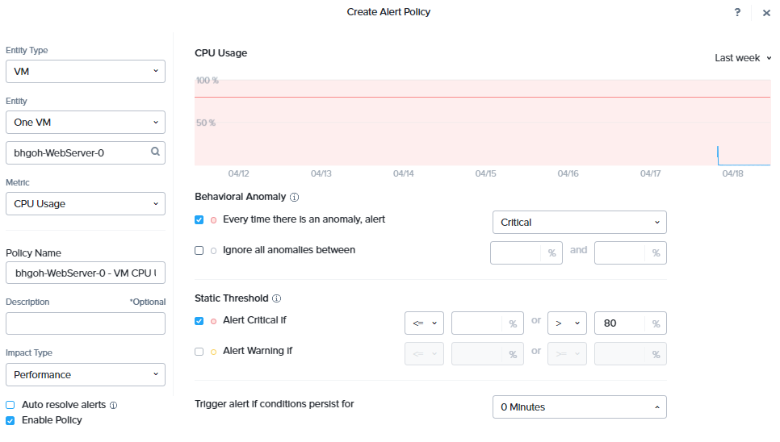
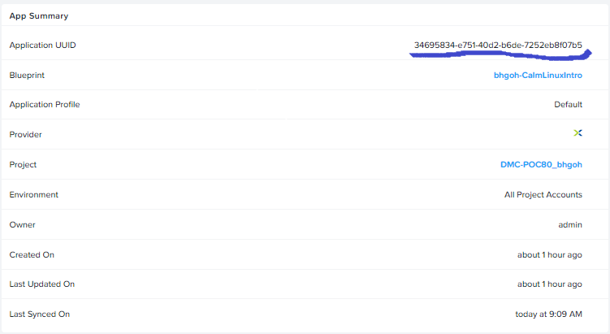
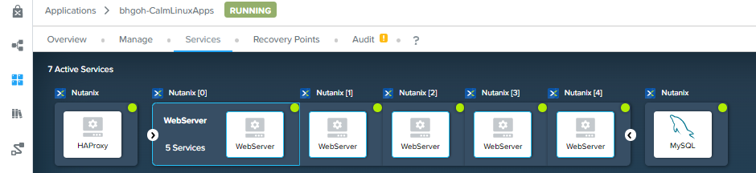

import Tabs from '@theme/TabItem';
import TabsItem from '@theme/TabItem';

With automating scale up of VMs in the last exercise, Sally has resolved multiple use cases
in her environment. It has reduced Support ticket numbers by up to 35% and increases productivity
by up to 20% . However, as certain applications such as web-servers benefits from a scale-out architecture
, as the number of users increases during the peak periods.

## Nutanix v3APIs

Although **HTML5 UI** is a key part to Prism to provide a simple and easy to use management interface. 
APIs are what is the core to enable automation. Nutanix has made APIs available through Prism Element
and Prism Central. At the current version at v3, countless of companies has taken advantage of them and
path automation as their way of managing Nutanix.

In the following section of this lab, we will make use of Nutanix v3APIs to automate the expansion of 
web-servers to automate scale-out and to achieve that we need a series of pre-steps:
- Create a custom alert.
- Determine the APIs.
- Create a Playbook that will scale-out the webserver.


## API Explorer

API Explorer, available through Prism Central, provides us with a list of available APIs and its documentation.
The Nutanix REST API Explorer is written and formatted using an API framework called Swagger (governed by Apache
license 2.0). The framework generates an interactive API document users can visualize and interact with, which Nutant’s 
commonly refer to as the Nutanix REST API Explorer.

The explorer is an expandable/collapsible, interactive hypertext document, organized by top-level resources (i.e. images, 
vms, hosts, storage containers, etc…), and their associated HTTP request operations (i.e**. GET, POST, DELETE, PUT**). 
When a resource operation is expanded, consumers are provided with descriptions, JSON Model definitions, and 
request/response panes for viewing messages and header and information.

Users navigate the explorer by scanning the document for a top-level resource (i.e. vms) they want to perform work on. 
Once a resource has been located, users can then expand the resource by performing a mouse-click on the resource name, 
exposing the supported HTTP request operations. Users can then interact with, and manipulate a resource instance using 
a given request operation from within the explorer view.

To view Nutanix API Explorer, please go to Prism Central and at the top right **admin** > **REST API Explorer**



This will immediately bring out a new tab and a series of resources with their associated operations. Oh yes! That's not 
all the APIs resource Nutanix has, every product we shipped, be it Nutanix Database Service,Calm, Nutanix Kubernetes Engine
etc, you can find all the API resources here - https://www.nutanix.dev/api-reference/

## Creating a User-Defined Alert

Like the previous exercise, we will now create a custom alert to send alerts to Prism whenever the CPUs 
utilization of the application hits a certain threshold.

1. In Prism Central, click **Activity** > **Alerts**.

2. Under **Alert Policies** > **User Defined**.

3. Click **Create Alert Policy**.

   :::note
   Since the last exercise in creating multi vm blueprints. There are already two centos webservers 
   that has already been created. We will make use of the server named : _your_initial_-WebServer-0
   :::

4. Fill out the fields as follows:
   - **Entity Type:** VM
   - **Entity:** One VM
       - _your_initial_-WebServer-0
   - **Metric:** CPU Usage 
       You will notice on the right panel of your screen. A CPU Usage policy window opens up.
       In the fields below, fill in the following:
       - **Behavioral Anomaly**
           - **Every time there is an anomaly, alert** - Critical       
       - **Static Threshold**
           - **Alert Critical if** > 80%
       - **Trigger alert if conditions persist for:** 0 Minutes
   - **Policy Name:** _your_initial_-WebServer-0
   - **Impact Type:** Performance 
   - **Auto resolve alerts** - unchecked the tick box
   

5. Click **Save**.

# Creating Policy

1. In Prism Central, click **Operations** > **Playbooks**.

2. Click **Create Playbook**.

3. Select **Alert**.
   - Under **Select an Alert Policy**. Search for the **Alert** name: _your_initial_-webserver-0 
   - **Target VM:** Specific VMs
   - Type **_your_initial_**. This should show up the target VM.

4. On the left panel, click **+ Add Action**. 
   - Select **Resolve Alert**.
   - **Target Alert:** Alert:Alert

5. In this action, we will be calling a REST APIs to invoke the ScaleOut action we have define in the blueprint in the last lab.
   On the left panel, click **+ Add Action**.
   - Select **REST API**.
     Fill out the fields below:
      - **Method:** POST
      - **URL:**  https://PC_IPAddress/api/nutanix/v3/apps/{uuid}/actions/run
          - PC_IPAddress = Prism Central IP Address
          - uuid of the Application
          
          - **Username:** admin
          - **Password:** _your_assigned_cluster_password
          - **Request Body:** { "name" : "ScaleOut" }
          - **Request Headers:** Content-type: application/json

6. Click **Save & Close**  
    - **Name:** _your_inital_-CalmApps
    - **Playbook Status** - please ensure you check **enable** the playbook. 

## Testing the Playbook

To test the playbook we need to simulate high CPU load on the webserver.

1. Go to **Calm** > **Applications** > _your_apps_

2. On the **Services** tab, expand the webservers, click on the webserver (_your_inital-WebServer-0),
   which is the server which we have define in our Alerts. 

3. On the right side of the panel, click **Open Terminal**. 

4. Click **ok** to the invoke credential to sign-in. This will bring out the terminal console
   of the webserver in a separate browser. 

5. In the console where you are login as centos user. Install Stress-Ng tool with the command:
   ```
   sudo yum install -y stress-ng 
   ```

6. Next, we will simulate high stress load on webserver-0 to invoke the playbook.
   ```
   stress-ng --cpu 4 --timeout 420s
   ```
   This will load stress the CPU on webserver-0 for a brief 7 mins.

7. Go to **Alert** > **List** to view the generated alerts.

8. Once the alert has been generated, go to **Playbooks**. Click on your playbook.

9. Go to **Plays** to see the status of your playbook. 

10. If the Status shows **Succeeded**, go over to **Calm** > **Applications** > **Services**.

11. You should observe that the number of webservers has scale from 2 to 5! 
    

12. Congratulations!!
    


