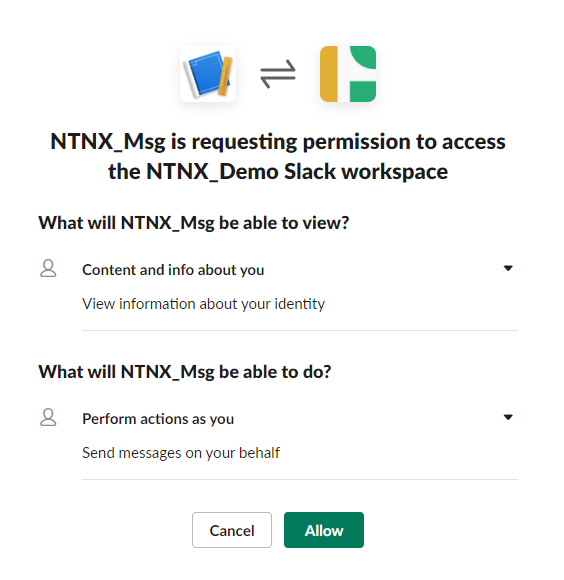
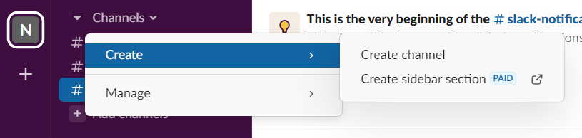
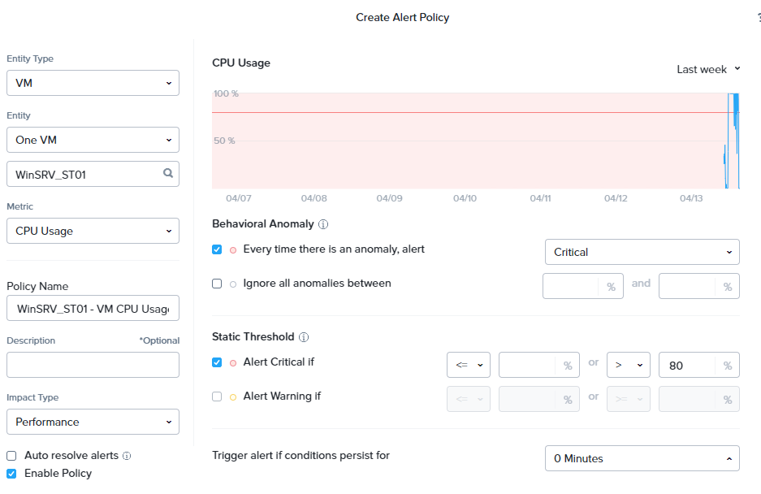
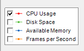
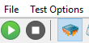

import Tabs from '@theme/TabItem';
import TabsItem from '@theme/TabItem';

Sally has managed to resolve application performance and stability issues with her knowledge
accquire through Calm Blueprints and with application automation she has also helped "bridge" the 
gap between the Developer and Infrastructure teams. However, in recent months, the infrastructure 
team has seen a surge in tickets requesting on VM resource expansion. Some of these request occurs 
over the weekends and some even in the late hours of workdays. As Sally has a track record of resolving
some critical issues in their IT operations, she has been tasked to look into the problem. 

Sally discovers that there are two main issues that causes the surge in tickets logged:

1. High CPU usages on the Engineering VMs is causing high latency in user experience. The bad 
   experience is causing ITOps to have to work over the hours to resolve the issues.

2. High peak traffic on the Web Farm is causing bad experiences on the users. Resulting in lost revenue,
   peak period are also unpredictable, making ITops unable to cope with the demand.

## X-Play

X-play is an easy to use automation tool that helps you to automate routine tasks,
and auto-remediate issues that may occur in your system. You can achieve this automation
by creating **Playbooks**.

Playbook allows you to define a trigger that results in the execution of an action or a series 
of actions. A trigger may be an event that occurs in the system, such as an alert or a request 
made by you. The resultant actions that you configure can be VM actions, communication actions, 
alert actions, or report actions.

## Scaling out a VM resource

In this exercise, we setup a playbook to automate scale out on the vCPUs of a VM, resolve an alert
automatically and then sends a notification message to **Slack**. Although in this lab this capability 
is demonstrated on a single VM, they can be applied across to a group of VMs based on their 
categories.

# Integrating Slack

Before we start creating alerts and playbooks in Prism Central, let's get integrate Slack into Prism 
Central.

# Creating a Slack application

1. Go to https://api/slack.com/apps
   If you do not have an account, please create an account and sign in.

2. Click **Create an App**.

3. Choose **From scratch** and give a name to the app.
   - **App Name:** e.g NTNX_Msg (or any random name you wish)
   - **Pick a workspace to develop your app in:** - select your workspace you define
   - Click **Create App**

4. In the **Basic Information** menu, do the following:
   - Click **Add features and functionality**
   - Click **Permissions** > **Scope** > 
     - **User Token Scopes:** chat:write

5. Back to *Basic Information** menu, do the following:
   - Click **Install to Workspace**, under **Install your app**.
   - Once the page is being re-directed to **My Workspace** authorization page.
   - Click **Allow**

   

6. The purpose of this is to obtain the authorisation token.
   - Go to the **Install app** 
   - Note the **OAuth Token for Your Workspace**token, as you will be needing it for the next lab.
  
   You will be using this token each time you use the **Slack** action in playbook.

7. Create a channel from your workspace as the sceenshot below:

   

   Name your slack channel as: "Alerts_your-initials" 

# Create Alert

Now, we will generate a policy that will generate an alert when it detects a constrained VM.

1. In Prism Central, click **Activity** > **Alerts**.

2. Under **Alert Policies** > **User Defined**.

3. Click **Create Alert Policy**.

   :::note
   There are already four Windows machine pre-populated in the labs for your exercise. They are label
   as WinSRV_ST01,ST02, ST03 and ST04 in each cluster.
   :::

4. Fill out the fields as follows:
   - **Entity Type:** VM
   - **Entity:** One VM
       - WinSRV_ST01 or WinSRV_ST02
   - **Metric:** CPU Usage 
       You will notice on the right panel of your screen. A CPU Usage policy window opens up.
       In the fields below, fill in the following:
       - **Behavioral Anomaly**
           - **Every time there is an anomaly, alert** - Critical       
       - **Static Threshold**
           - **Alert Critical if** > 80%
       - **Trigger alert if conditions persist for:** 0 Minutes
   - **Policy Name:** WinSrv_ST01 or 02 High vCPU Usage 
   - **Impact Type:** Performance 
   - **Auto resolve alerts** - unchecked the tick box
   

5. Click **Save**.

# Creating Policy

1. In Prism Central, click **Operations** > **Playbooks**.

2. Click **Create Playbook**.

3. Select **Alert**.
   - Under **Select an Alert Policy**. Search for the **Alert** name: WinSRV_ST01 or 02 High vCPU Usage 
   - **Target VM:** Specific VMs
   - Type **WinSRV_ST01/02**, depending on your chosen VM

4. On the left panel, click **+ Add Action**. 
   - Select **VM Recovery Point**.
   - **Target VM:** WinSRV_ST01 or 02

5. On the left panel, click **+ Add Action**.
   - Select **Power off VM**.
   - **Target VM:** WinSRV_ST01 or 02

6. On the left panel, click **+ Add Action**.
   - Select **VM Add CPU**.
   - **Target VM:** WinSRV_ST01 or 02
   - **vCPUs to Add:** 2
   - **Maximum Number of vCPUs:** 4
   Note: we are trying to increase the vCPUs frm 2 to 4.

7. On the left panel, click **+ Add Action**.
   - Select **Power On VM**.
   - **Target VM:** WinSRV_ST01 or 02

8. On the left panel, click **+ Add Action**.
   - Select **Resolve Alert**.
   - **Target Alert:** Source Entity

9. On the left panel, click **+ Add Action**.
   - Select **Slack**.
     This is the stage where you will be utilizating the slack token that you have created earlier.
     Under **Slack** please fill out the following fields:
     - **Slack Token** : copy and paste the **User OAuth Token**
     - **Channel Name :** _your_channel_name_
     - Copy and paste the following message into the **Message** field.
     ```
     The following VM has vCPUs increase from 2 to 4.   
     ```
10. Click **Save & Close**  
    - **Name:** 
    - **Playbook Status** - please ensure you check to **enable** the playbook.

## Testing your Playbook.

Now this is the time to test the playbook which you just created.

1. In Prism Central, go to **Compute & Storage** > **VMs**

2. Click on your allocated machine e.g WinSRV_ST01 or WinSRV_ST02

3. Click ** Launch Console**.

4. Login into the machine with the password: nutanix/4u

5. At the desktop icon, click **HeavyLoad**.
   **HeavyLoad** is a free stress test tool that enables us to simulate high stress load on the CPU
     that is need for our exercise.

6. Once **HeavyLoad** is open, check on the stress test marker - cpu at the center of the screen.
   


7. Click on the green play button at the top left of the window.
   

8. You will immediately notice that load of the CPU will increase tremendously.

9. Minimize the console window and click **Metrics** in Prism Central window and observe the 
   CPU Usage(%) hitting 100%.

10. Next, open another Prism Central in a tab in your browser. 

11. Go to **Activity** > **Alerts** and wait for the alert to be generated. (it will usually take 5 mins or more)

12. Once the alert is generated, head back to the **VM Metrics** browser. Click **Summary* and you will
    notice that the vCPUs has increased from 2vCPUs to 4vCPUs.

13. Open up your **Slack** and you will notice a message coming through that says the VM has its CPU increased.

Thats wraps up this exercise!!


