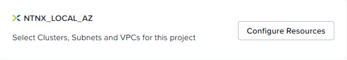

import Tabs from '@theme/TabItem';
import TabsItem from '@theme/TabItem';

## Create Project 

Sally has recently joined Fantasy Financial Company as their IT Dev/Ops engineer. 
The company has invested and standardise Nutanix HCI as their Hybrid Cloud of choice. 
During the course of her work, she found that there has been a high volume of support 
tickets logged around application stability.
She further finds out that the main cause on the stability was the fact that the 
applications created on these machines were based on many different configurations 
such as:

- different memory profiles
- different core:p.core ratio
- different software dependencies

This has resulted in inconsistent behaviour on their applications, leading to many 
support calls. Determined to fix the issues, she decides to automate the provisioning 
of vms in the environment to provide a consistent delivery of these applications.

## Create a Project in Calm

A project in Calm defines a group or users to manage common set of requirements or 
functions. For example, an administrator can define resources such as existing 
networks, VMs resources into an Marketing Project, associate its members to it and 
set usage limits on the infrastructure resources.

1. Let's start by first creating a project. In the Calm interface, click on the bottom
   left toolbar.

2. Next, click on **+Create Project** button

3. Fill in the Project Name. Please fill in your **_your-initials_-project**. 
   e.g bhgoh-project
   

# Adding Users/Groups & Resources

1. In the **Summary** box, at the first box - Users, Groups and Roles, 
   click **+ Add User**.

2. Click **Add/Edit Users & Groups** to proceed to the next step.

3. Click **+ Add User**.

4. In the following window, please fill in an adminuser and a consumer user as
   define in the screenshot below. These are pre-configured AD users that has been
   define based on your cluster number. Do note that you are to add in the users xx,
   where xx is your assigned cluster number.

8. Click on the **infrastructure** tab.

9. Click on **Add Infrastructure** button and select the default account given.

10. Click on **Configure Resources**

11. Next, select the cluster and select **+ Select VLANs** to proceed.

12. Choose **Primary** tick the checkbox beside it. 
    Click **Confirmed and Select Default** to complete the configuration.

## VM configuration

To enable application blueprints to be publish in the Marketplace, you will need to 
define the base VM configuration. To do so please follow the steps below:

1. Go back to **Projects** if you have exited out of the window and click on the 
   project name which you have just created.

2. Click **+ Add Environments** and click **Create Environment**.

3. Enter the name of your assigned cluster and your initials as below.

4. Select the drop down menu and choose the pre-define Accounts. It should be
**NTNX_LOCAL_AZ** Then click **next** to proceed.

5. Expand the option with the blue drop down menu as below:

6. In the VM configuration box, you will need to define the base configuration of both
   Windows and Linux. Please fill in the information below:

   # Windows

   a. In the **cluster** option, open the menu and select your cluster.

   b. For the vm resources:
      - vCPUs = 2
      - Cores per vCPU = 2
      - Memory GiB = 4

      You will notice at the far right corner of the bar, there is a running man inconsistent
      . This denotes as a run-time variable which allows a user
      to dynamically define the vm resources at the launch of the blueprint.

   c. In the **Disk1** section, under **Image** select **Windows2019.qcow2** image.

   d. Scroll down to **Network Adaptors NICs**. Click the **+ icon** .
      You will see **NIC 1** section. Select **Primary**.

   e. Click **+ Add Credential** and fill in the options:
      - Name: Win_admin
      - Username: administrator
      - Password: nutanix/4u

5. Next, scroll back up and click **Linux** and repeat with the following options.

   # Linux
     
      a. In the **cluster** option, open the menu and select your cluster.

   b. For the vm resources:
      - vCPUs = 2
      - Cores per vCPU = 2
      - Memory GiB = 4

      You will notice at the far right corner of the bar, there is a running man inconsistent
      . This denotes as a run-time variable which allows a user
      to dynamically define the vm resources at the launch of the blueprint.

   c. In the **Disk1** section, under **Image** select **CentOS7.qcow2** image.

   d. Scroll down to **Network Adaptors NICs**. Click the **+ icon** .
      You will see **NIC 1** section. Select **Primary**.

   e. - Name: CentOS7
      - Username: root
      - Password: nutanix/4u   

6. Click **next** and **Save Environment**. 
      
7. You should notice that the environment is ready for:

   - Blueprint Creation
   - Marketplace Usage

Great job!! You have now a working Project which are ready for Marketplace publishing.

## Key Takeaways

With projects and it's variables defined, Sally can now create blueprints that are 
accessible by the team, standardise the resources and dependencies require so that 
it minimises human errors and stablises the platform for further applications. In addition,
there is a Nutanix Marketplace feature where Sally through a group of project related users
can published their applications for consumers to access their applications through a one click
mechanism.

We will look at publishing those applications right after creating them.

   

