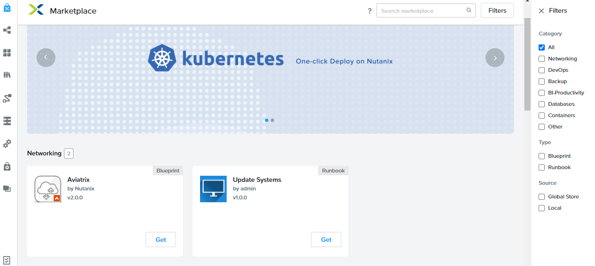
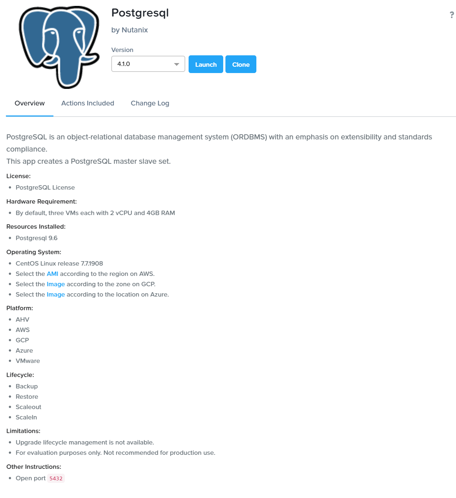
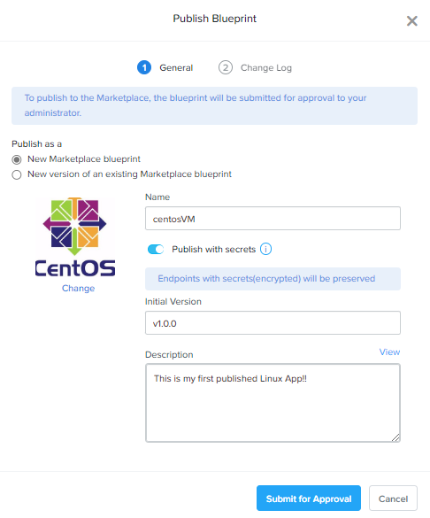
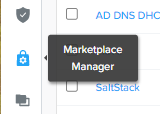
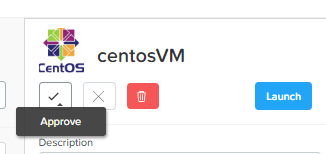
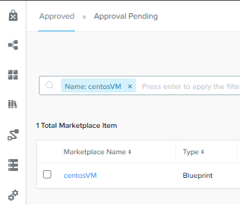
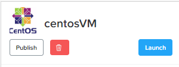
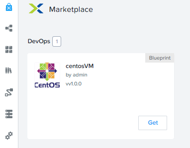

import Tabs from '@theme/TabItem';
import TabsItem from '@theme/TabItem';

## Nutanix Marketplace Overview

As part of orchestration and provisioning of Nutanix Self Service, Nutanix Marketplace 
provides preconfigured application blueprints and runbooks for instant consumption.
The marketplace is a common platform for both publishers and consumers.

The marketplace has banners to display featured applications. All listed application displays
icon of the platform that supports the application.
Before provisioning an application, you can view details such as application overview, changes
made in different versions, and application-leve actions.

## Nutanix Marketplace

As the application blueprints have been created, Sally would like to published these 
applications into the Nutanix Marketplace, where users can access to those applications
and provisioned them seaminglessly. The self provisioning feature will highly increase workplace
collaboration, costing optimization and productiviy.

## Publishing Blueprints

Part of the getting an application into the Marketplace requires a pre-process of qualification,
reviewing and final approval before an application can be published. This approval process 
in-conjunction with Nutanix role base access feature allows greater security on application access
and promotes overall collaboration between the teams.

1. In **Prism Central** > **Calm** > **Blueprint**, open up your single VM blueprint.

2. At the top of the right-hand banner, click **Publish**. 
   :::note
   Prior to publishing the application, please make sure that the blueprint is free of errors 
   and warnings.
   :::

3. In **Publish Blueprint** window, please fill in the fields below:
   - **Publish as a:** New Marketplace blueprint 
   - **Name:** CentosVM
   - **Publish with secrets:** slide to turn it on
   - **Initial Version:** v1.0.0
   - **Description:** This is my first published Linux App!
   - **Change:** replace it with a centos icon ;) google it!
   
   
   Click **Submit for Approval** to complete the process.
   
4. Now head over to **Marketplace Manager**. 
   It is the 2nd last icon on the left banner menu.
   
   

5. In **Marketplace Manager**, click **Approval Pending**. You will see the blueprint that you have 
   submitted for approval appears in there. 

   :::note
   In production environment, generally you will have developers, dev/ops engineer and a project
   manager working alongside on the project. There will also be consumers of the applications. 
   The roles provided will the seaminglessly provide the required collaboration without compromising
   security. 
   :::

6. Click on the submitted blueprint under **Marketplace**. A banner will appear on the right.

7. In the fields on the right banner, fill these out:
   - **Category**: Dev/Ops 
   - ** Projects Shared With**: select your own project.
   
   Click on the tick icon the complete the approval.
   
   

8. Click on the tab **Approved** and search for your application.
   
   

9. Click on the submitted blueprint and a right banner will appear.
   Click **Publish** to complete the process.

   

10. Now go to the **Marketplace** in Calm and you will see your application published there.

     

11. Repeat the same process with the Mulit-VM app. (optional)

